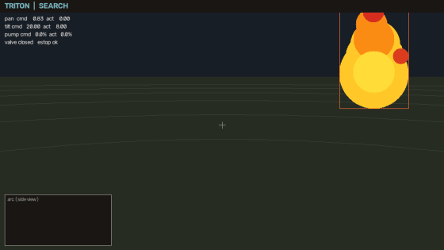
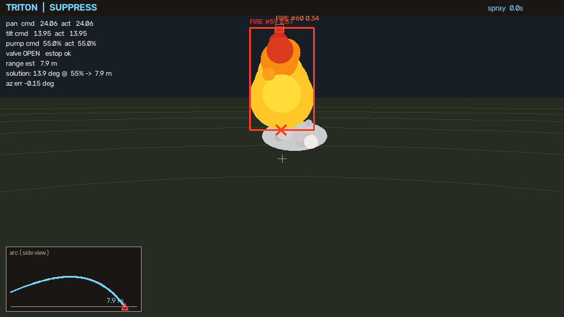
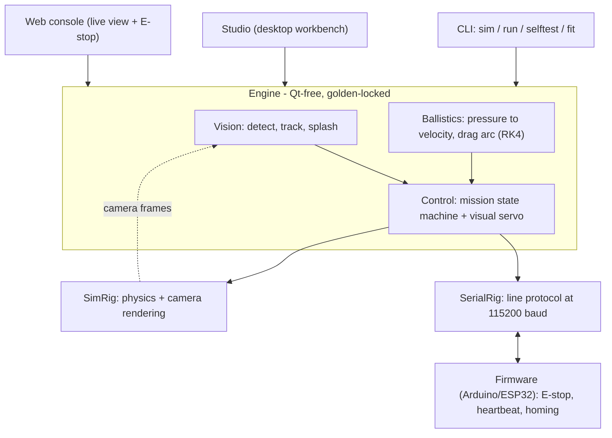
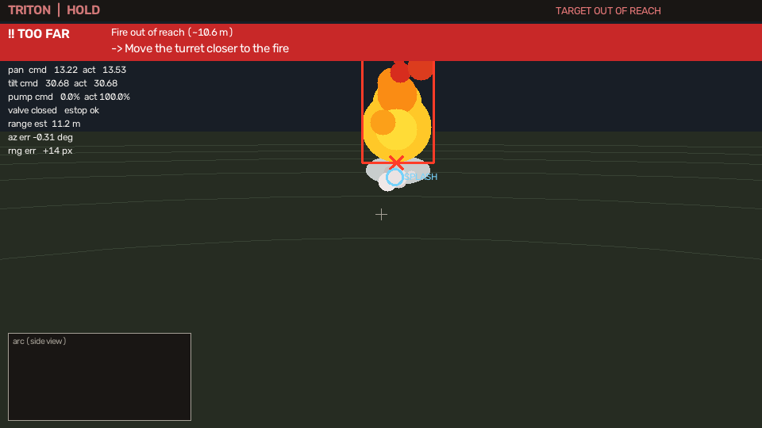
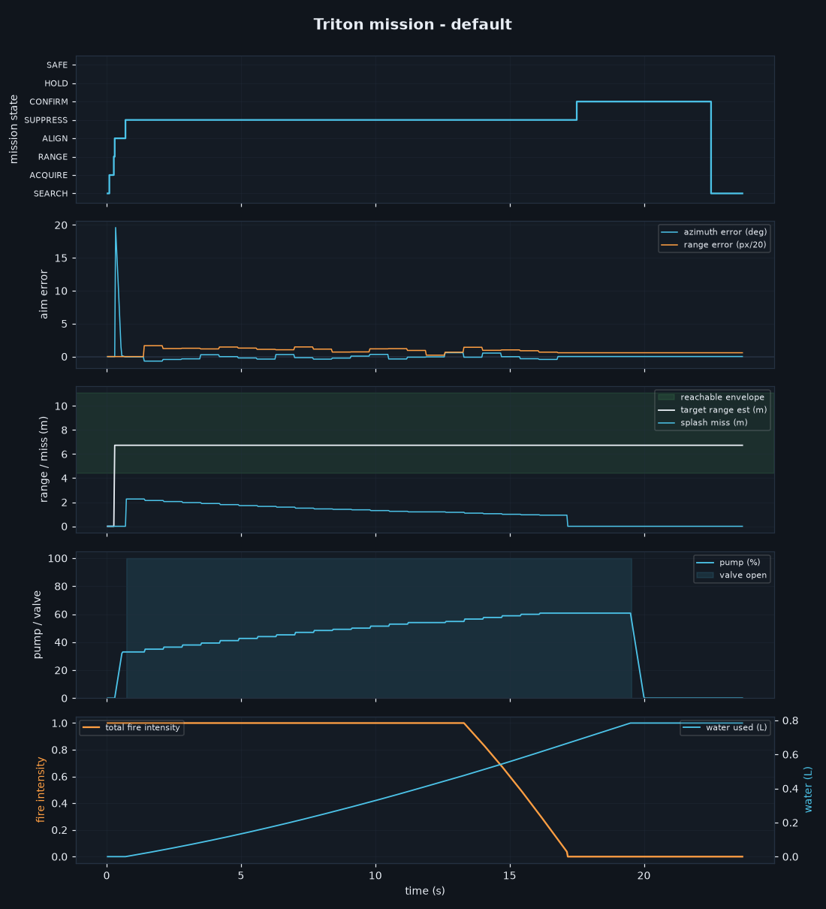
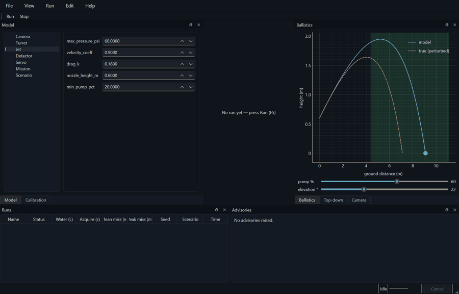

# FireTurret - camera-guided fire-suppression turret

[](https://github.com/Leo-Y-Zhang/FireTurret/actions/workflows/ci.yml)


> ## Read this first
>
> **This is a supervised engineering demonstrator, not a fire-safety product.**
>
> - **No physical turret exists.** None has been built, and none has ever been
>   pointed at a real fire. Every figure, GIF, number and result in this
>   repository comes from the simulator or from unit tests.
> - **No life-safety claim is made anywhere, and no certification is held or
>   sought.** This does not replace smoke alarms, extinguishers or sprinklers,
>   and must never be relied on to protect people or property.
> - **Water is the wrong agent for electrical and grease fires**, and the
>   software does not attempt to tell fire types apart.
> - The hardware path (serial to microcontroller firmware) is written and
>   unit-tested, but **has never been validated against a real turret**.
> - If you build the rig from [`docs/BUILD_GUIDE.md`](docs/BUILD_GUIDE.md), treat
>   it as a hobby experiment: supervised, dry-aim first, on a small deliberate
>   test flame, outdoors, with a real extinguisher to hand.
>
> Read the software as a controls-and-vision exercise. Do not read it as
> protection.

This project takes camera footage, detects fire it has never seen, and aims
a pan/tilt water cannon at it — correcting its own aim by **watching where the
water actually lands** (closed-loop visual servoing). The same software drives
either turret firmware over serial or a built-in physics-and-rendering
simulator, so the whole system — perception, ballistics, and control — is testable
end to end with **no hardware at all**, which is how all of it has been tested.

**The non-obvious part:** a single camera measures *direction*, not *distance* —
yet distance is exactly what a ballistic aimer needs. This turret never estimates
it. It sees the fire and the water splash in the same frame and drives the
splash *pixel* onto the fire *pixel*, so every error source — an imperfect ballistic
model, drag, gusting wind, the boresight offset between camera and nozzle — shows
up as a splash-to-fire gap and is servoed away.



*A full autonomous mission in the simulator (~3× speed): search, acquire, aim,
and close-loop suppression driving the observed splash onto the fire. Below, a
single annotated frame during suppression.*



> Reminder: everything above is the **simulator**. Supervised demonstrator,
> **not a life-safety device** — see *Read this first*.

## Highlights

- **Novel control idea** — closed-loop *visual servoing* that never measures
  distance: it drives the observed water splash onto the fire in image space.
- **Breadth** — classical computer vision (colour + temporal-flicker fire
  detection), control theory (a mission state machine + two servo loops),
  drag-corrected projectile ballistics (RK4), real-time systems, an embedded
  Arduino/ESP32 firmware, and a line protocol between them.
- **A desktop engineering workbench** — *Studio* (PySide6/pyqtgraph):
  live plots, a scenario editor, batch parameter sweeps on a thread pool,
  and a calibration tool — with the simulation run off the GUI thread.
- **Test rigor** — 871 tests (823 fast + 48 slow); the engine's exact behaviour is
  pinned by *golden regression fixtures*, and the desktop app is tested headless at
  the data layer.
- **Hardware-honest** — the software genuinely interfaces the firmware over
  serial, with connection verification, a dry-aim safety default, and a
  `selftest` command; calibration lives in a config file, not source.

## The idea: don't measure distance

A camera tells you the *direction* to a fire (which pixel), but not the
*distance* — and distance is what sets how far to lob the water. This design
sidesteps the hard problem entirely:

1. Point roughly at the fire and open the valve.
2. **See the splash** in the same camera frame.
3. Drive the splash *pixel* onto the fire *pixel* — pan closes the horizontal
   gap, pump pressure closes the vertical (range) gap.

Both the fire and the splash are directly observed, so every source of error —
an imperfect ballistic model, drag, **gusting wind**, and the boresight offset
between the camera and the nozzle — shows up as a splash-to-fire gap and gets
servoed away. (There's a `windy` scenario and a test that proves the loop rejects
a crosswind/headwind the ballistic model knows nothing about.)
The camera rides the pan stage, which is what makes the azimuth loop able to
correct boresight: panning moves the fire's bearing but not the splash's, so the
pan that lines their columns up also points the nozzle at the fire.

A drag-corrected projectile model (`ballistics.py`) still computes a sensible
*opening* shot from a rough range guess; the closed loop cleans up whatever the
model gets wrong.

## Pipeline

```
Camera frame  (webcam · video file · simulator)
      │
      ▼
Fire detection      HSV ∧ YCbCr colour rules + temporal flicker  → fire blobs
Tracking            persistence + negative evidence              → confirmed target
Splash detection    desaturated moving water, colour-separated from fire
      │
      ▼
Mission state machine   SEARCH · ACQUIRE · RANGE · ALIGN · SUPPRESS · CONFIRM  (SAFE on fault)
Visual servo            pan ← splash↔fire column gap · pump ← splash↔fire row gap
      │
      ▼
Rig                 serial to the turret firmware · or the physics simulator
```

Suppression runs an **observe-then-correct** cycle: it holds the aim dead still
while collecting splash observations (frame-differencing needs a still camera),
takes the median, applies one small bounded correction, and repeats. That is what
keeps noisy per-frame vision from driving the servo into oscillation.

## Architecture

One Qt-free engine, driven by three interchangeable front-ends and running against
either the simulator or real hardware behind a single rig interface:



The CLI, the desktop workbench, and the web console are thin shells over the same
`simcore` engine — so the exact behaviour the tests pin is the behaviour every
front-end runs, and the whole stack is exercisable with no hardware.

The fire detector is **injectable**: the classical HSV+flicker detector is the
zero-dependency default, but a learned model drops straight in
(`--detector onnx --model fire.onnx`) and runs GPU-accelerated via ONNX Runtime's
TensorRT/CUDA providers — with an **NVIDIA Jetson** as the natural on-device
target. See [`docs/GPU_DETECTOR.md`](docs/GPU_DETECTOR.md).

## Run it

**Prerequisites: Python 3.11 or newer, and nothing else on Windows or macOS.** On
Debian/Ubuntu the OpenCV and Qt wheels dlopen system libraries that are not in the
wheels: `sudo apt-get install -y libgl1 libglib2.0-0 libegl1 libxkbcommon0
libdbus-1-3`. Without `libegl1` even a headless `QT_QPA_PLATFORM=offscreen` run
dies with `ImportError: libEGL.so.1: cannot open shared object file`, which does
not read like a missing-package error.

```bash
python -m venv .venv && . .venv/Scripts/activate   # Windows; use bin/activate on *nix
pip install -e .

python -m fireturret sim                 # full mission in the simulator (a window opens)
python -m fireturret sim --headless      # same, no window; prints the outcome
python -m fireturret sim --scenario multi # default, close, offset, far, unreachable, multi, windy, decoy, moving
python -m fireturret run --source 0      # your webcam: fire detection + aim preview (no hardware)
python -m fireturret run --source clip.mp4
python -m fireturret run --source 0 --port COM3   # hardware: dry-aim (no water) unless --arm-water
python -m fireturret selftest --port COM3         # exercise the actuators + verify the link (dry)
python -m fireturret web --source 0      # browser console on loopback; --host 0.0.0.0 --expose to reach it from a phone

pip install -e .[desktop]            # PySide6 + pyqtgraph, for the desktop workbench
python -m fireturret studio              # Studio — the desktop engineering workbench
```

**Browser interface.** `fireturret web` serves a live annotated stream, the operator
warnings, and a remote E-stop over HTTP. Use `--source sim` to try it with no
hardware. Deploying on a Raspberry Pi is a plug-in-the-camera, one-command
affair — see [`docs/RASPBERRY_PI.md`](docs/RASPBERRY_PI.md).

It binds to **loopback** by default. The console has no authentication and its
`POST /estop` latches the mission into SAFE and disarms water with no rearm path
from the browser — so on an open network anyone could irreversibly disable a
fire-suppression device. Reaching it from a phone is therefore a deliberate act:
`--host 0.0.0.0 --expose`, then open e.g. `http://raspberrypi.local:8000`. Put it
behind a VPN or an authenticating reverse proxy rather than a flat LAN.

Nothing is actuated unless you pass `--port` — and even on hardware the pump/valve
stay **off** unless you add `--arm-water` and confirm, so first bring-up is always
dry-aim. That same gate covers the self-test's pump pulse: `fireturret selftest` is
dry unless you pass `--arm-water` and type ARM. It exercises each actuator and
checks the link first;
`fireturret fit shots.csv` calibrates the ballistic model; `--config turret.json`
loads a saved calibration (Studio can export one). The safe, gated
bring-up procedure is in [`docs/COMMISSIONING.md`](docs/COMMISSIONING.md).

## What it handles

Because the loop closes on what it *sees* (the splash relative to the fire),
it copes with things an open-loop aimer cannot. Each is a built-in scenario
(`--scenario <name>`) and a test:

| Scenario | What it demonstrates |
|---|---|
| `default` / `offset` | model error — the true jet's speed, drag, and boresight differ from the model, and the loop corrects it |
| `windy` | a gusting crosswind/headwind the ballistic model knows nothing about, rejected by watching the splash |
| `moving` | a fire that spreads laterally — the servo fully tracks its azimuth each cycle (up to ~4°/s) |
| `multi` | several fires — extinguished one after another (CONFIRM → SEARCH → next) |
| `decoy` | a static fire-coloured object (a red cloth, a warning light) that is **never** sprayed — the flicker gate rejects it |
| `unreachable` | a target beyond the jet's reach — recognised, not hosed indefinitely (HOLD with backoff) |
| `close` / `far` | the near and far ends of the reachable envelope |

## Operator warnings

The turret aims itself, but it's fixed in place — so when a fire is genuinely
outside its envelope, the right move is for a person to reposition it. It
raises structured, actionable **advisories** telling the operator exactly what's
wrong and what to do:

- **TOO FAR** — "Move the turret ~N m closer"
- **TOO CLOSE** — "Move the turret ~N m back"
- **OUT OF TRAVERSE** — "Rotate the turret base left/right" (fire beyond the pan limit)
- **OBSTRUCTED** — "Clear the line of fire or reposition" (can't see the water land)
- **SAFETY** — E-stop engaged or telemetry lost

They show as a colour-coded banner in the overlay and drive a **warning
LED/buzzer output** on the hardware (`x=` in the serial protocol, `WARN_PIN` in the
firmware) so the operator is alerted even away from the screen.



## Building the real turret

**This rig has not been built.** The guide below is a design on paper, checked
against the protocol the firmware implements — it is not a validated build, and
nobody has commissioned one. Anyone following it is prototyping, not installing
fire protection.

The full bill of materials, wiring, assembly, firmware flashing, calibration, and
safety checklist are in **[docs/BUILD_GUIDE.md](docs/BUILD_GUIDE.md)**. In short:
a Raspberry Pi 5 runs this software and talks over USB serial to an Arduino/ESP32
(`firmware/turret_firmware/`) driving a NEMA-17 pan stage, a tilt servo, a 12 V
pump, and a valve — with a hardware emergency-stop that cuts pump and motor power
independently of the software.

## Analysis & data export

Every simulated mission can record a per-frame telemetry trace and turn it into
an engineering report:

```bash
python -m fireturret sim --headless --log run.csv --report mission.png
pip install -e .[analysis]   # matplotlib, for --report
```

`--log` writes the raw trace (state, pan/tilt/pump, aim error, range estimate,
splash miss, fire intensity, water) as CSV for your own analysis; `--report`
renders a multi-panel figure — the mission-state timeline, aim-error convergence,
range tracked inside the jet's reachable envelope, pump pressure, and fire
knockdown vs water used. It reads the whole run at a glance:



## Studio — the desktop engineering workbench

For interactive analysis there is **Studio**, a PySide6/pyqtgraph desktop
application — an engineering workbench in the spirit of OpenRocket or ParaView.
Edit any model or scenario parameter, press **Run**, and watch the mission unfold
live; every finished run is captured for comparison.



*Editing the jet model, then a full multi-fire mission playing out live across the
telemetry plots and the model-vs-true ballistic arc.*

```bash
pip install -e .[desktop]
python -m fireturret studio
```


It embeds the same simulation engine the CLI uses (one code path, guarded by
golden regression fixtures), running it on a worker thread so the UI stays fluid.
Panels:

- **Model editor** — every config sub-system (camera, turret, jet, detector,
  servo, mission) and the scenario, with validation and full undo/redo.
- **Live telemetry** — five X-linked plots (mission-state timeline, aim error,
  range vs the reachable envelope, pump/valve, fire intensity vs water), with a
  **crosshair readout** that reports every value at the time under the cursor.
- **Camera** — the live annotated frame; **Top-down** — a bird's-eye scene view
  (turret, fires, decoy over the reachable annulus).
- **Ballistics explorer** — drag pump/elevation to see the water arc, with the
  *true* (perturbed) arc overlaid so the model-vs-reality gap is visible.
- **Runs table** — every run as a row (outcome, water, acquisition, miss, seed);
  **double-click to replay** a run, multi-select to **overlay/compare** them, and
  edits mark past runs *stale*.
- **Advisories** — the operator warnings a run raised (out of reach, too close,
  obstructed) with how long each was active.
- **Batch sweep** — vary one or two parameters across a grid, run them in
  parallel, and read the outcome surface as a heatmap or scatter.
- **Calibration** — enter measured shots, fit the jet model, apply it to config.

Docks are rearrangeable and the layout persists between sessions (View ▸ Reset
layout restores the default).

Sessions save to `*.fireturret.json`; runs export as CSV + a JSON sidecar. The
existing `fireturret web` viewer remains the lightweight live/Pi operator console.
Design rationale is in [`docs/STUDIO.md`](docs/STUDIO.md) and
[`docs/THEORY_OF_OPERATION.md`](docs/THEORY_OF_OPERATION.md).

## Testing

```bash
pip install -e ".[dev,analysis,desktop]"   # test extras — quoted for zsh
pytest                    # 823 fast tests by default (of 871; run the slow tier with -m slow)
python scripts/verify.py  # THE gate: ruff, both pytest tiers, SPDX, git identity, installed import
```

`pip install -e .` on its own is not enough to test: `[dev]` carries pytest,
pytest-qt and a Qt binding, and `[desktop]` carries pyqtgraph, which
`tests/studio/conftest.py` imports in a session fixture. `[analysis]` is the one
genuinely optional part — the two tests that need matplotlib `importorskip` it
and otherwise skip — but it is included above because that exact line is what
`.github/workflows/ci.yml` installs, so it is the parity command.

`scripts/verify.py` is authoritative and the GitHub Actions workflow is a thin
wrapper around it, so "green locally" and "green in CI" are the same assertion by
construction. A clean full run is **6/6 PASS** — measured 2026-08-03 on Windows
11 / Python 3.13: ruff 0.2s · spdx 0.1s · identity 0.0s · pytest fast 120.1s ·
pytest slow 947.4s · installed import 0.1s.

The native crash that made the fast tier unreliable through 2026-08-03 was found
and fixed on 2026-08-03: a finished run's `QThread` was released while it was
still running, so Qt aborted the process. `MainWindow.run()` now joins the
previous thread before rebinding it, and two regression tests pin that. The
before/after evidence and the failure mechanism are in
[`docs/TDD.md`](docs/TDD.md#the-qt-crash-found-and-what-it-actually-was).

Unit tests cover geometry, the ballistic solver (range/elevation/pump inversion,
drag, high-arc lob), fire detection (positives, static-object and grey-scene
negatives), tracking, splash detection, the servo control laws and convergence,
every mission transition and failsafe, and the serial protocol. The flagship
**end-to-end** test runs the real detector on rendered frames and requires the
system to extinguish a simulated fire whose *true* physics (discharge
coefficient, drag, and a boresight bias) differ from the controller's model —
which only succeeds because the closed loop corrects the model error. Golden
fixtures pin the engine's exact behaviour (so the CLI/Studio-shared refactor
cannot regress), and the desktop app is tested headless
(`QT_QPA_PLATFORM=offscreen`, pytest-qt) at the data layer.

## Design

[`docs/ARCHITECTURE.md`](docs/ARCHITECTURE.md) explains why the control is shaped
the way it is — every choice traces back to *a single camera measures direction,
not distance.*

The four design documents are written retrospectively, from the code rather than
from this README, and each is explicit about where the system falls short:

- [`docs/PRD.md`](docs/PRD.md) — the problem, who it is for, what is out of
  scope, and the alternatives that were rejected and why
- [`docs/TDD.md`](docs/TDD.md) — as-built technical design: data model,
  interface contracts, the failure-mode table, and rollback
- [`docs/APP_FLOW.md`](docs/APP_FLOW.md) — every state of the CLI, the browser
  console and the workbench, and the dry-to-wet transition all three share
- [`docs/DESIGN_BRIEF.md`](docs/DESIGN_BRIEF.md) — visual intent, the real
  palette, and measured contrast ratios including the one that fails

## Layout

- `src/fireturret/vision/` — fire detection, tracking, splash detection, scene renderer
- `src/fireturret/ballistics.py`, `geometry.py` — projectile model and camera geometry
- `src/fireturret/control/` — the mission state machine and the visual servo
- `src/fireturret/rig/` — the hardware abstraction: serial driver, simulator, protocol
- `src/fireturret/simcore.py` — the Qt-free simulation core (`simulate` + `drive`), shared by the CLI and Studio
- `src/fireturret/studio/` — Studio, the desktop workbench (optional `[desktop]` extra)
- `src/fireturret/ui/` — the operator overlay
- `firmware/turret_firmware/` — the Arduino/ESP32 sketch
- `docs/BUILD_GUIDE.md` — how to build the physical turret

## Non-goals

No certified fire-fighting performance claims. No network dependency —
everything runs locally, and `tests/test_scene.py` asserts that by making sockets
raise and running a full pipeline.

(The fixed turret was previously a non-goal boundary too. It no longer is: the
mobile platform tier treats a bolted-down turret as the **zero-motion case** of
the same code path rather than a separate one. Optional scene understanding is
the single subsystem capable of a network call, and it is off by default and
refuses to construct without an explicit data-flow acknowledgement.)

## A note on the name

This project was called **Triton** until August 2026. The repository was renamed
first and the code was deliberately left alone, on the argument that a package
name is an interface rather than a label: renaming it breaks every import in the
tree, every plugin entry point, and every saved artefact. That argument did not
hold for long. On 11 August the rename was carried through the rest of the tree —
the distribution name, `src/triton/` to `src/fireturret/`, the `TritonConfig`
dataclass, the `*.triton.json` saved-session extension, the ROS 2 frame ids and
the workbench window title — so the compatibility break was taken rather than
avoided. Nothing in the tree answers to the old name now; the dated design record
under `docs/specs/` still carries it in its filename.

The rename also dissolved a real packaging problem rather than documenting it
forever. While the distribution was named `triton` it shared both its
distribution name and its import name with the GPU kernel compiler of that name
on PyPI — the one PyTorch declares as a dependency, so it turns up in a very
large number of environments without anyone choosing it. pip treated the two as
one distribution: installing either **uninstalled the other**, with no error and
no warning, because from pip's point of view that is an ordinary upgrade of
`triton`. `pip install torch` could quietly replace this package, and
`pip install -e .` here could quietly break a working PyTorch install.
`fireturret` is not taken on PyPI, so none of that applies to it. Installing into
a per-project virtual environment, as *Run it* above does, remains the right
habit — it is just no longer the only thing standing between you and a broken
PyTorch install.

## Licence

**Proprietary, source-available for evaluation only** — see [`LICENSE`](LICENSE)
and [`NOTICE`](NOTICE). You may read this code to assess the author's work. You
may not copy, modify, redistribute, ship it in anything, or use it as training
data.

Author and copyright holder: **Leo Y. Zhang**.

This reverses an earlier decision, and the earlier reasoning is worth recording
rather than deleting. This project shipped under Apache-2.0 because its outbound patent
grant matters for a hardware and control project: it lets someone build on the
work without fear of a later patent claim. That rationale was sound, and it is
being given up deliberately — a portfolio piece is published to be *evaluated*,
not adopted, and Apache-2.0 grants commercial reuse that is not intended here.
Anyone who does want to build on this should ask; the terms are negotiable, the
default is not.

Third-party licences are audited in
[`docs/LICENCE_AUDIT.md`](docs/LICENCE_AUDIT.md). Two things worth knowing
before you package anything:

- **PySide6 (the `[desktop]` extra) is copyleft.** This project does not bundle it and
  a core install does not need it, but anyone shipping a bundled artefact takes
  on the LGPL-3.0 obligations for that portion.
- **No model weights are shipped**, and none is downloaded by default. Many
  popular detection weights are AGPL-3.0, which would be incompatible with this
  licence — the weights you supply to `--detector onnx --model PATH` are yours
  to license.

Contributions are accepted under the DCO (`git commit -s`); see
[`CONTRIBUTING.md`](CONTRIBUTING.md), which also explains why there is no CLA.
Report vulnerabilities *and physical incidents* through GitHub Private
Vulnerability Reporting — see [`SECURITY.md`](SECURITY.md).
