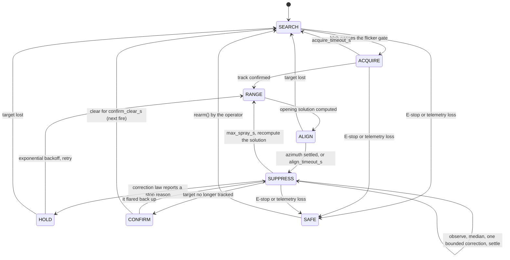

# App Flow — FireTurret

There are three interactive surfaces over one engine: a **CLI**, a **browser
console** (`triton web`), and a **desktop workbench** (`triton studio`). They are
documented together because the safety-critical transition — *dry to wet* — is the
same in all three, and the only interesting question about this application's flow
is where that transition can happen and what stops it happening by accident.

[PRD.md](PRD.md) · [TDD.md](TDD.md) · [SAFETY.md](SAFETY.md)

## Three ways in

| Surface | Command | Reached by |
|---|---|---|
| Simulator | `python -m triton sim [--scenario NAME]` | anyone, no hardware |
| Live / hardware | `python -m triton run --source 0 [--port COM3]` | a shell on the host |
| Browser console | `python -m triton web --source 0\|sim` | a URL, loopback by default |
| Hardware self-test | `python -m triton selftest --port COM3` | commissioning step 2 |
| Calibration fit | `python -m triton fit shots.csv` | commissioning step 4 |
| Desktop workbench | `python -m triton studio` | needs the `[desktop]` extra |

There is no login, no onboarding and no first-run wizard. `sim` is the front door:
it needs no hardware, no configuration and no arguments.

## First run to first water

1. **`python -m triton sim`** — a window opens on a rendered scene. The turret
   sweeps in SEARCH, latches a fire, ranges, aligns, sprays, and confirms. The
   header band names the state; the process exits `0` if the fire went out and
   `1` if it did not. `--headless` does the same with no window and prints the
   outcome. *Nothing here can actuate anything.*
2. **`python -m triton run --source 0`** — the same pipeline on a real webcam,
   with **no `--port`**. Detection and an aim preview only; the rig is a
   `NullRig` that echoes commands back as instantly-achieved telemetry.
3. **`python -m triton selftest --port COM3`** — the first command that talks to
   hardware. It verifies the link, then exercises each actuator. Water stays off:
   the pump pulse is exactly as wet as a mission's, so it is behind the same gate.
   Pass condition, printed: `telemetry link: PASS`.
4. **`python -m triton fit shots.csv`** — enter measured shots
   (`pump_pct,elevation_deg,measured_range_m`), get fitted `velocity_coeff`,
   `drag_k` and `max_pressure_psi`. Save them into a config file rather than into
   source.
5. **`python -m triton run --source 0 --config turret.json --port COM3`** —
   dry-aim on real hardware. Pan and tilt track the fire; the pump and valve stay
   off.
6. **`… --arm-water`** — the only path to water. The process asks:

   ```
   Arm water? Type ARM to enable pump/valve (anything else = dry):
   ```

   Only the exact string `ARM` arms. Anything else — including `arm`, `y`, an
   empty line, or EOF — falls through to dry, and the process prints
   `Re-run with --arm-water (and type ARM) to enable water.` The rig is still
   handed back wrapped in a `GuardedRig`, **constructed disarmed**, so even a
   successful arm passes every command through the water gate.

Steps 1–5 cannot wet anything. Step 6 requires a flag *and* a typed word, at a
terminal, with the operator present. That ordering is the flow's whole point, and
it is the same for `run`, `web` and `selftest`.

## Every state of every surface

### CLI — `sim` / `run`

| State | What the operator sees |
|---|---|
| Loading | source opening; a failed camera or serial port raises with the device named, not a bare traceback |
| Empty | no fire detected — SEARCH sweeps at `search_pan_rate_dps`; the header reads `SEARCH` continuously rather than looking hung |
| Populated | annotated frame: tracked blobs, target crosshair, splash marker, state band, side-view arc inset |
| Error | serial refused / telemetry stale → mission latches **SAFE**, valve closed; the banner says so and it does **not** auto-resume |
| Unauthorised | not applicable — no accounts; the equivalent is *unarmed*, which is the default and is stated on screen |
| Slow | at 30 Hz the loop is the frame rate. ⚠ A degraded 4 Hz host currently has **no** indicator — `TickWatchdog` is built but unwired (see [SAFETY.md](SAFETY.md)) |

### Operator advisories — the state that matters most

The turret aims itself but cannot move itself, so the interesting error state is
"this fire is not mine to fight". Advisories carry a severity (`INFO` / `WARN` /
`CRITICAL`), a message, and — non-negotiably — an **action**:

| Kind | Message | Action given |
|---|---|---|
| `TOO_FAR` | fire beyond the jet's reach | "Move the turret ~N m closer" |
| `TOO_CLOSE` | fire inside the minimum reach | "Move the turret ~N m back" |
| `OUT_OF_TRAVERSE` | fire at the left/right pan limit | "Rotate the turret base left/right" |
| `OBSTRUCTED` | splash never observed for `SUPP_NO_FEEDBACK_CYCLES` cycles | "Clear the line of fire or reposition" |
| `SAFETY` | E-stop engaged or telemetry lost | operator intervention |

In the video overlay only the most urgent is shown as a banner and the rest are
counted (`+N more`); the browser console shows the top one alone. The same signal
drives a hardware **warning LED/buzzer** (`x=` in the protocol,
`WARN_PIN` in the firmware), because the operator is often not looking at the
screen. **Colour is never the only signal** — every banner carries the severity
word and the action text.

### Browser console — `triton web`

| Screen | Loading | Empty | Populated | Error | Unauthorised | Offline / slow |
|---|---|---|---|---|---|---|
| `/` | `connecting...` in the status line | stream up, no fire: state reads `SEARCH` | MJPEG stream + state/pan/tilt/pump line + advisory banner | poll failure is swallowed and retried every 400 ms — the last good status stays on screen | **no such state**: there is no authentication | stream stalls; status line stops updating; **no explicit stale marker** |
| `POST /estop` | — | — | toggles, returns `{"estop": …}` | 404 on any other path | anyone reachable can call it | — |

Two honest defects in this table, both recorded rather than hidden:

- **A stalled poll looks like a live one.** The status line keeps its last value
  and the page never says "stale". On a lossy phone link that is misleading.
- **`POST /estop` is unauthenticated and it latches.** There is no rearm path
  from the browser — by design, because a browser-rearmable E-stop is not an
  E-stop — which means anyone who can reach the port can irreversibly disable the
  device. It binds to loopback, and `--host <addr> --expose` is required to leave
  it precisely so that exposure is a typed act.

### Desktop workbench — `triton studio`

| Screen | Loading | Empty | Populated | Error | Slow |
|---|---|---|---|---|---|
| Main window | window title is `Triton Studio`, prefixed `*` when the session is dirty; docks restore from the last layout | **first run: no runs, empty plots** — the Model dock is populated and Run (F5) is the obvious next act | five X-linked plots, camera view, top-down scene, runs table, advisories, ballistics explorer | uncaught exceptions are routed by `install_excepthook` to a **non-modal dialog plus a log**, not a crash | the simulation runs on a worker thread; the UI stays live, the status bar shows progress and an enabled **Cancel** |
| Model editor | — | defaults from `TritonConfig()` | grouped fields with undo/redo | an invalid value **raises in `__post_init__` and is not committed** — the edit is rejected, the model stays valid | — |
| Runs table | — | an empty table with its column headers — no placeholder text, which is the weakest empty state in the app | one row per run (outcome, water, acquisition, miss, seed) | — | edits mark earlier runs **stale** rather than silently comparing incomparable data |
| Sweep | progress bar | grid not yet run | heatmap / scatter over the outcome surface | a failed cell is reported, not dropped | runs cells on a thread pool; cancellable |

The workbench never touches hardware: it drives the simulator. A `SimStep`
carries a mutable `TickResult` and a raw frame and is consumed in-thread; only
frozen telemetry and copied frames cross into the GUI.

## The mission state machine



Every state can enter SAFE; only `rearm()` leaves it. HOLD's retry dwell is
`min(hold_retry_s x unreachable_streak, 45 s)` — a target that stays unreachable
is rechecked ever less often, so the machine stops test-spraying water it cannot
land.

Two properties of this diagram are load-bearing:

- **SAFE is reachable from everywhere and leaves only by operator action.** A
  fault that clears on its own does not resume the mission.
- **SUPPRESS is a cycle, not a continuous state.** Frame-differencing needs a
  still camera, so the aim is held dead still while splash observations
  accumulate, the median is taken, *one* bounded correction is applied, and the
  system settles. That cadence is what stops per-frame vision noise driving the
  servo into oscillation.

## What each state permits

There are no roles. The only privilege is **water**, and it is not a property of
the user but of the command, re-evaluated on every tick by the water gate:

| Condition | Effect on the next command |
|---|---|
| not armed | water removed |
| pan axis not homed (or `h=` absent) | water removed |
| telemetry stale (`ok=False`) | water removed |
| spray time past the gate's 1.5× backstop | water removed |
| any registered veto denies, is stale, or raised | water removed, and a denial **latches** |
| mission not in SUPPRESS/CONFIRM-soak | valve closed by the mission before the gate ever sees it |

"Access revoked mid-flow" has a literal analogue: pull the USB cable and
telemetry goes stale within `heartbeat_timeout_s`; the gate denies water, the
mission latches SAFE, and the firmware's own 500 ms watchdog cuts water without
the host's involvement. Nothing waits for a page refresh.

## Dead ends, and the one latch

- **SAFE is deliberately a dead end** in software: it does not auto-resume, and
  the browser cannot rearm it. Exiting requires clearing the physical condition
  and restarting the mission from a terminal. That is a designed dead end, not a
  defect — but a `web`-only operator on a Raspberry Pi has genuinely no way
  forward from the browser, and should know that before pressing the button.
- **`HOLD` is not a dead end**: it backs off and retries via RANGE, so an
  unreachable target does not silently end the mission.
- No other state can be entered with no way out.

## Accessibility across three surfaces

Honestly assessed, per surface, because they are not equal:

- **CLI.** Fully keyboard-operable by nature; all state is printed as text as well
  as drawn. `--headless` yields a text-only run with a meaningful exit code, which
  is the most screen-reader-friendly path through the whole system.
- **Browser console.** Single page, one focusable control (E-STOP), reachable by
  Tab and activated by Enter/Space as a native `<button>`. Advisory banners carry
  text, not just colour. Gaps, stated: no `aria-live` region, so a screen reader
  is not told when an advisory appears; the MJPEG stream has `alt="live view"`
  but no textual equivalent of what it shows; there is no reduced-motion
  consideration for the stream.
- **Desktop workbench.** Qt gives keyboard navigation, focus rings and OS-level
  scaling for free. It ships **dark-only** (`#10151c` surface, `#e8edf4` ink),
  which respects neither `prefers-color-scheme` nor a high-contrast system theme.
- **The video overlay** is the weakest surface: OpenCV-drawn text at a fixed
  0.42–0.55 scale that does not respond to system font size, and no alternative
  representation. The state name and advisory text are always written out, so
  colour is never the sole carrier, but the overlay is a picture and cannot be
  read by assistive technology.
