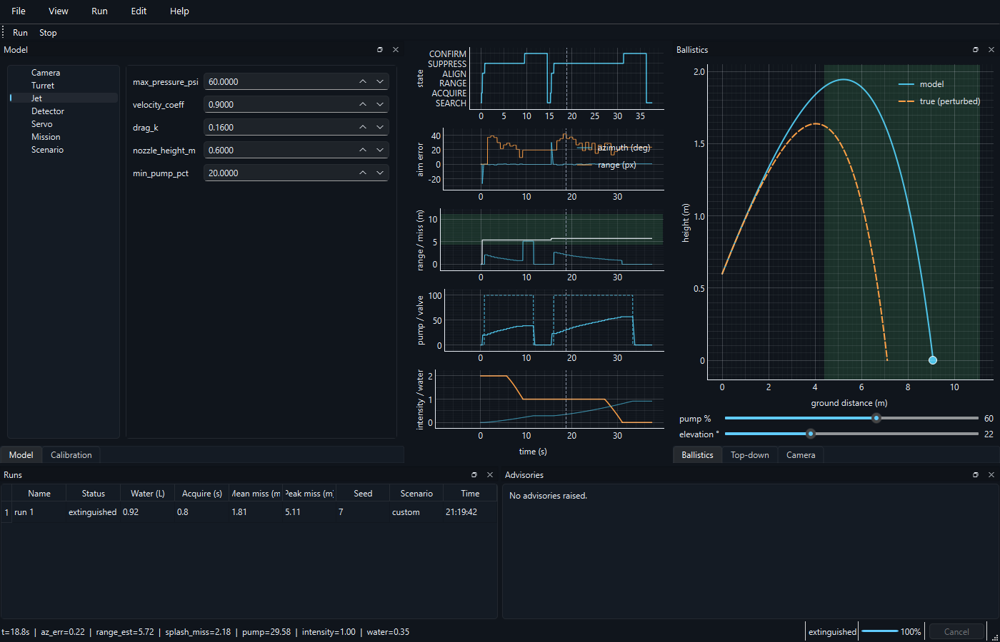

# Studio — the desktop engineering workbench

Studio is a desktop **engineering workbench** for the fire-suppression
turret — built to the calibre of tools like OpenRocket or ParaView. You edit a
model, run a simulation, and inspect the result deeply, all in one application.

It is an optional component: `pip install -e .[desktop]` (PySide6 + pyqtgraph),
then `python -m fireturret studio`. The core package and CLI never depend on Qt.



## Design principles

- **The GUI never computes physics.** All perception, ballistics, and control stay
  in the Qt-free engine (`fireturret.simcore`, `fireturret.ballistics`, …). Studio only
  orchestrates and renders. This keeps the tested engine authoritative.
- **One engine, one behaviour.** The CLI and Studio both drive the simulation
  through `simcore.drive()`. Its exact behaviour (metric accumulation order, the
  extinguish-tail stop policy, advisory sets) is pinned by golden regression
  fixtures (`tests/golden/`), so the shared refactor cannot silently drift.
- **The simulation runs off the GUI thread.** A `SimWorker` (moved onto a
  `QThread`) runs `drive()` and streams results back via signals. Telemetry is
  emitted losslessly in coalesced batches; camera frames are latest-wins. The UI
  never blocks, and cancellation is cooperative.
- **Editing is validated and undoable.** Every parameter edit reconstructs the
  frozen dataclass (running its `__post_init__` validation) and is pushed onto a
  `QUndoStack`.

## Architecture

```
src/fireturret/
  simcore.py            # Qt-free: simulate() generator + drive() shared loop
  studio/
    app.py              # QApplication bootstrap, dark theme, `fireturret studio` entry
    main_window.py      # QMainWindow: docks, menus, status bar, run/sweep orchestration
    session.py          # Session document (config + scenario) + dirty + QUndoStack
    worker.py           # SimWorker (moveToThread) streaming telemetry/frames
    throttle.py         # clock-injected emission throttle (lossless telemetry)
    sweep.py            # batch sweep grid + parallel QThreadPool runner
    io.py               # session/run persistence (from_dict + tuple coercion)
    models/runs_table.py  # QAbstractTableModel of completed runs
    views/              # plots, camera, top-down, ballistics, sweep, calibration, model editor
```

- **Session** is the single shared document (a `FireTurretConfig` + a `SimScenario`).
  Views read from it; the model editor writes to it via `set_field`.
- **Persistence** uses an explicit `from_dict`/`to_dict` (not bare `asdict` + the
  top constructor, which would leave nested sub-configs as dicts and skip
  validation). Tuple fields (`extra_fires`, `decoy`) are coerced back to tuples so
  values round-trip through JSON by equality.

## The panels

| Panel | What it does |
|---|---|
| **Model** | Tree of the six config sub-systems + the scenario; a properties form per node with validation and undo/redo. |
| **Live telemetry** | Five X-linked pyqtgraph panels: mission-state timeline, aim error, range vs the reachable envelope, pump/valve, fire intensity vs water. |
| **Camera** | The live annotated frame (the same overlay the CLI draws), streamed from the worker. |
| **Top-down** | Bird's-eye scene: turret at the origin, fires and the decoy by azimuth/range, over the reachable annulus. |
| **Ballistics** | Drag pump and elevation to see the water arc redraw over the reachable envelope, with the *true* (perturbed) arc overlaid dashed. |
| **Runs** | Every finished run as a row (outcome, water, acquisition time, mean/peak miss, seed, scenario, time). Rename/delete via right-click. |
| **Batch sweep** (Run ▸ Batch sweep…) | Vary 1–2 parameters across a grid × seeds, run them in parallel, and read the outcome metric as a heatmap (2 axes) or scatter (1 axis). |
| **Calibration** | Enter measured shots, fit the jet model (`ballistics.fit_jet`), see measured-vs-predicted range, and apply the fit to the config. |

## Batch sweeps

A sweep expands one or two parameter axes (each a value range × steps) over a seed
set into a grid of independent cells. Each cell runs `drive()` with its own
`SimRig(seed)` over a frozen config/scenario snapshot, so cells are safely parallel
on a `QThreadPool`. Cells return only metrics — no matplotlib runs on pool threads
(pyplot is not thread-safe). Cancellation sets a flag every remaining cell reads,
so an aborted sweep finishes promptly while keeping completed results.

## Files

- **Session**: `File ▸ Save As…` writes `*.fireturret.json` (config + scenario);
  `File ▸ Open…` loads one. Recent files are remembered.
- **Run**: `File ▸ Save last run…` writes the telemetry as CSV plus a JSON sidecar
  (config snapshot, scenario, seed, metrics).

## Testing

The engine and all pure logic are covered by ordinary unit tests. The GUI is
tested **headless** with `QT_QPA_PLATFORM=offscreen` and pytest-qt, at the *data
layer* (asserting the arrays a plot received, model contracts via
`QAbstractItemModelTester`, worker signals with `qtbot.waitSignal`, deterministic
cancellation via an injected step-iterator and clock) rather than by comparing
pixels. Run the desktop tests with `pytest tests/studio`.

## Platform notes

pyqtgraph OpenGL is disabled (raster rendering only) for portability on managed
machines. Launch via `python -m fireturret studio` (or the `fireturret studio` subcommand)
— no separately-installed executable is required.
